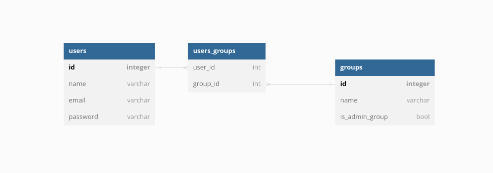

# User Management System
## Setup
### Requirements
Your machine needs to be able to run Laravel apps and Docker. See https://laravel.com/docs/10.x for more info.

### How to run the app
1. Get the source code
```
git clone git@github.com:shadowinek/user-management.git
cd user-management
```

2. Install the app dependencies
```
composer install
```

3. Create a local config file
```
cp .env.example .env
```

4. Setup your `APP_KEY`
```
php artisan key:generate
```

5. Run your local server
```
./vendor/bin/sail up -d
```

Use `./vendor/bin/sail down` to stop the server.

6. Run the migrations
```
./vendor/bin/sail php artisan migrate:fresh --seed 
```

7. Install and run the npm
```
./vendor/bin/sail npm install
./vendor/bin/sail npm run dev
```

8. Open in your browser and enjoy. The default url should be http://localhost or http://127.0.0.1

You can login with email `admin@example.com` and password `password` 

#### Database
MySQL database `laravel` is available on 127.0.0.1:3306 with user `sail` and password `password`. You can change this in your `.env` config.

## Design
### Stories
* As an admin I can add users — a user has a name.
* As an admin I can delete users.
* As an admin I can assign users to a group they aren’t already part of.
* As an admin I can remove users from a group.
* As an admin I can create groups.
* As an admin I can delete groups when they no longer have members.

### Assumptions
* Any user can become an admin. This will be done if the user is part of the Admin group.
* Admin group can't be deleted.
* User in an admin group can't be deleted.

### Database model


* The model is really simple. It includes only 2 tables that are connected with many-to-many relation.
* Because users could be admins they need email and password to be able to authenticate.
* I used https://dbdiagram.io/d to create this. I didn't include the fields that Laravel adds automatically (e.g. `created_at`, `updated_at`)

The used DBML is:
```
Table users {
  id integer [primary key]
  name varchar
  email varchar
  password varchar
}

Table groups {
  id integer [primary key]
  name varchar
  is_admin_group bool
}

Table users_groups {
  user_id int [ref: > users.id]
  group_id int [ref: > groups.id]
}
```

### API
#### `/users` endpoint
* POST `/users` - create user
* GET `/users` - get all users
* GET `/users/{id}` - get user with {id}
* PUT `/users/{id}` - update user with {id}
* DELETE `/users/{id}` - delete user with {id}

#### `/groups` endpoint
* POST `/groups` - create group
* GET `/groups` - get all groups
* GET `/groups/{id}` - get group with {id}
* PUT `/groups/{id}` - update group with {id}
* DELETE `/groups/{id}` - delete group with {id}
* POST `/groups/{group_id}/users/{user_id}` - add user with {user_id} into group with {group_id}
* DELETE `/groups/{group_id}/users/{user_id}` - remove user with {user_id} from group with {group_id}

Note: I missed an endpoint for mass assignments in my original design

## Dev Diary
#### 24/05 12:30 (15m)
* Initial setup of the Laravel app
* I went with Laravel framework as I have the most recent experience with it

#### 24/05 13:30 (45m)
* Added a simple design
* I didn't include the domain model. The last time I did a proper UML was 10+ years ago and I would need more time to refresh my knowledge of it.

#### 24/05 15:00 (1h30m)
* Users in the Admin group could login into the system. Other users shouldn't be able to login.

#### 24/05 18:00 (2h30m)
* Added CRUD for Groups
* Styling with Tailwind CSS, that is included in the Laravel, is kind of hell. I spent more time on that than the rest around  

#### 25/05 09:00 (3h)
* Added CRUD for Users
* TODO: Groups/Users assigment

#### 25/05 10:00 (3h30m)
* Added Groups/Users assigment
* The base user stories should be now implemented

#### 25/05 10:30 (4h)
* Instead of API implementation I spent the rest of the time on manual tests and small fixes

### Summary
#### What went well
* My knowledge of Laravel is not that dated as I thought and I spent less time reading the documentation than expected.
* Timing and task planning was good, and I was able to stick to my original plan (expect the API implementation)

#### What went wrong
* Tailwind (and frontend in general) is not my cup of tea and I struggled a lot with it
* I should refresh my knowledge about UML
* The assumptions I gave myself complicated some aspects of the implementation (e.g. additional conditions for group/user edit so it's not possible to delete an active admin)

#### Improvements for the next time
* Start with the API implementation
* Start with Bootstrap instead of Tailwind, because I am more familiar with it
* Add tests

#### Final thoughts
* My last interaction with Laravel was more than 3 years ago, and coming back to it was better than expected. I would still need more time to figure out all the best practices.
* Before I started to implement the task in Laravel I played around with Symfony for a while, but it would take me even more time to finish as my latest experience with it is 10+ years old.
* I prefer tech tasks in a spirit of https://www.codingame.com/ or https://adventofcode.com/. This task feels more focused on my framework knowledge than on my coding skills.
